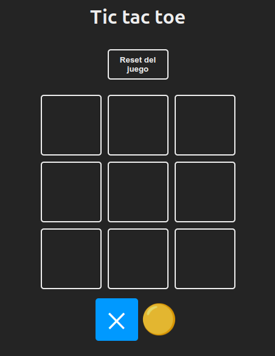
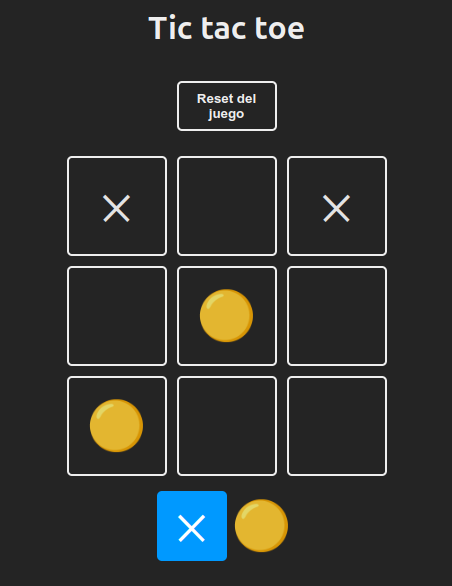
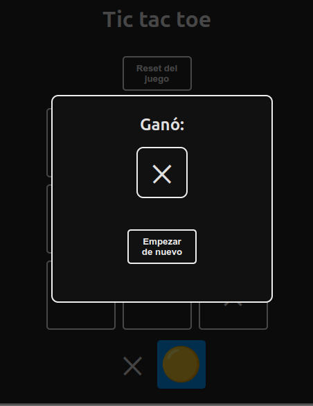
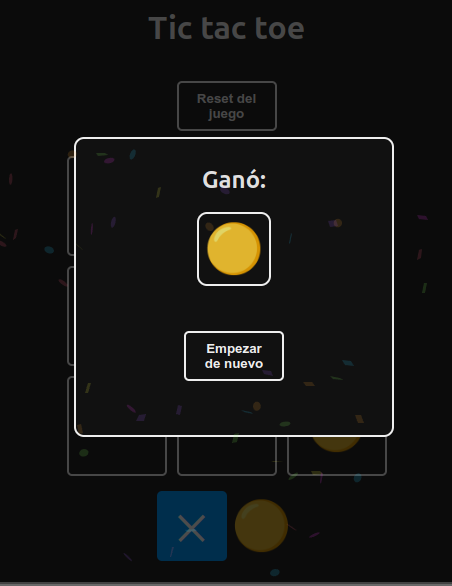

# Descripción del Repositorio
- Este repositorio contiene el juego tic-tac-toe en cual se ponen en practica los conceptos aprendidos con la libreria React de Javascript.

- Para la realizacion de este proyecto se utilizaron las siguientes tecnologias:
  - [Html](https://developer.mozilla.org/es/docs/Web/HTML): Lenguaje de marcado para estuctura basica del proyecto en la web.
  - [Css](https://developer.mozilla.org/es/docs/Web/CSS): Lenguaje de estilos para dar presentacion al proyecto web.
  - [Javascript](https://developer.mozilla.org/es/docs/Web/javascript): Lenguaje de programación para desarrollo de forntend y Backend.
  - [React](https://es.react.dev/): Biblioteca Javascript diseñada para crear interfaces de usuario con el objetivo de facilitar el desarrollo de aplicaciones en una sola página.
  - [JSX](https://es.react.dev/learn/writing-markup-with-jsx): (JavaScript Syntax eXtension), es una extensión de sintaxis para JavaScript que permite escribir marcado similar a HTML dentro de una archivo JavaScript.

## Imagen del proyecto

## Link del proyecto
- Visita el sitio web del [Juego](https://juego-tic-tac-toe2.netlify.app). 
